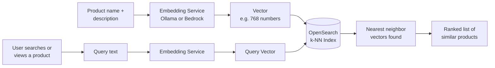
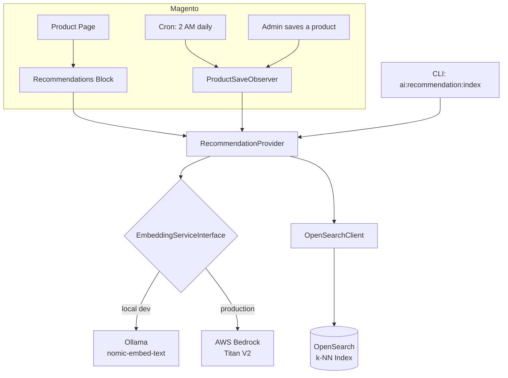

# Custom_AiProductRecommendation

AI-powered product recommendations and semantic search for IndiaHandmade.com, using OpenSearch k-NN vector search with locally-generated (Ollama) or cloud-generated (AWS Bedrock) embeddings.

---

## Table of Contents

- [What This Module Does](#what-this-module-does)
- [How It Works](#how-it-works)
- [Architecture](#architecture)
- [File Structure](#file-structure)
- [Local Setup (Development)](#local-setup-development)
- [Production Setup](#production-setup)
- [CLI Commands Reference](#cli-commands-reference)
- [Languages Supported](#languages-supported)
- [Cost (Production)](#cost-production)
- [Troubleshooting](#troubleshooting)

---

## What This Module Does

- **Smarter Search** — a user searches "silk saree" → the query is converted to a vector → OpenSearch k-NN finds semantically similar products, even if they don't share exact keywords.
- **Product Recommendations** — a user views a product → a "You May Also Like" section on the product page shows similar products, based on stored vector similarity rather than manual category rules.
- **Nightly Updates** — a cron job at 2 AM re-embeds any products that changed that day, so recommendations stay fresh without a full manual re-index.

---

## How It Works



**In plain terms:**

```
All products get converted to vectors (numbers representing meaning)
         │
         ▼
   Stored in OpenSearch
         │
         ▼
User searches "silk saree" or views a product
         │
         ▼
The search term / product also gets converted to a vector
         │
         ▼
OpenSearch finds the closest product vectors (k-nearest neighbors)
         │
         ▼
Most semantically similar products are returned
```

A vector is just a list of numbers that represents the *meaning* of the text — products with similar meaning end up with vectors that are mathematically "close" to each other, even if they don't share any of the same words.

---

## Architecture



**Key design decision:** the module talks to embeddings through `EmbeddingServiceInterface`, not a concrete class directly. Swapping from Ollama (free, local, slower) to Bedrock (paid, cloud, faster/more consistent) is a **one-line change** in `di.xml` — no other code needs to change.

---

## File Structure

```
Custom/AiProductRecommendation/
├── registration.php
├── README.md
├── etc/
│   ├── module.xml          → Module declaration
│   ├── di.xml               → Dependency injection (swap Ollama/Bedrock here)
│   ├── config.xml           → Default config values (hosts, ports, index name, model)
│   ├── crontab.xml          → Nightly cron schedule (2 AM)
│   └── events.xml           → Product save observer registration
├── Model/
│   ├── EmbeddingServiceInterface.php   → Interface for embedding services
│   ├── OllamaEmbeddingService.php      → LOCAL dev — uses Ollama nomic-embed-text
│   ├── BedrockEmbeddingService.php     → PRODUCTION — uses AWS Bedrock Titan V2
│   ├── OpenSearchClient.php            → All OpenSearch operations (create index, bulk index, search)
│   └── RecommendationProvider.php      → Core logic, caching, language mapping
├── Console/Command/
│   ├── SetupIndexCommand.php           → bin/magento ai:recommendation:setup
│   └── IndexProductsCommand.php        → bin/magento ai:recommendation:index
├── Cron/
│   └── UpdateEmbeddings.php            → Nightly delta embedding update
├── Observer/
│   └── ProductSaveObserver.php         → Refreshes embedding when a product is saved
└── Block/Product/
    └── Recommendations.php             → Frontend block for the product page widget
└── view/frontend/
    ├── layout/
    │   └── catalog_product_view.xml    → Places the block on the product detail page
    └── templates/
        └── recommendation-widget.phtml → HTML/CSS for the "You May Also Like" section
```

---

## Local Setup (Development)

### Requirements
- PHP 8.3+ (Magento 2.4.9 requires 8.3+)
- Magento 2.4.6+
- OpenSearch 2.x or 3.x
- Ollama (for local embeddings — free, no API key needed)

> **Note:** the steps below assume a native Windows/XAMPP setup. If you're on Mac/Linux, or prefer containers, swap steps 1–2 for the Docker commands in the [Docker alternative](#docker-alternative-mac--linux--wsl) section below.

### Step 1 — Start OpenSearch

```powershell
cd path\to\opensearch\bin
opensearch.bat
```

Verify it's running:
```powershell
curl http://localhost:9200
```

> If you hit `OpenSearchException[No SSL configuration found]`, add `plugins.security.disabled: true` to `opensearch.yml` for local dev (see Troubleshooting).

### Step 2 — Start Ollama and pull the embedding model

```powershell
ollama pull nomic-embed-text
curl http://localhost:11434
```
Should return: `Ollama is running`

### Step 3 — Install the module

```powershell
cp -r Custom/AiProductRecommendation app/code/Custom/
php bin/magento module:enable Custom_AiProductRecommendation
php bin/magento setup:upgrade
php bin/magento cache:flush
```

### Step 4 — Create the OpenSearch index

```powershell
php bin/magento ai:recommendation:setup
```

### Step 5 — Generate initial embeddings

```powershell
php bin/magento ai:recommendation:index
```
This indexes every enabled product across all configured store views. For a catalog of ~2,000 products this typically takes 15–30 minutes locally on CPU (each product needs one embedding call to Ollama); for a much larger catalog (tens of thousands of products), expect proportionally longer, or consider Bedrock for production-scale speed.

### Docker alternative (Mac / Linux / WSL)

```bash
docker run -p 9200:9200 -e discovery.type=single-node -e plugins.security.disabled=true opensearchproject/opensearch:2.11.0
docker run -p 11434:11434 ollama/ollama
docker exec -it <ollama_container> ollama pull nomic-embed-text
```

---

## Production Setup

### Switch from Ollama to AWS Bedrock

Edit `etc/di.xml`:
```xml
<preference for="Custom\AiProductRecommendation\Model\EmbeddingServiceInterface"
            type="Custom\AiProductRecommendation\Model\BedrockEmbeddingService"/>
```

Then:
```bash
bin/magento setup:di:compile
bin/magento cache:flush
```

No other code changes are needed — `RecommendationProvider`, the CLI commands, and the cron job all depend on the interface, not the concrete class.

### Languages Supported

| Store ID | Language  | Code |
|----------|-----------|------|
| 1        | English   | en   |
| 2        | Hindi     | hi   |
| 3        | Gujarati  | gu   |
| 4        | Malayalam | ml   |

> Each store ID must exist as an actual Store View in Magento (Admin → Stores → All Stores) for that language to be indexed. Indexing a store ID that doesn't exist will simply find 0 products for it.

---

## CLI Commands Reference

| Command | What it does | Options |
|---|---|---|
| `bin/magento ai:recommendation:setup` | Creates the OpenSearch k-NN index. Run once, or after deleting the index to rebuild it. | none |
| `bin/magento ai:recommendation:index` | Generates embeddings for all enabled products and bulk-indexes them. | `--store=N` — only index one store<br>`--limit=N` — cap number of products (useful for testing) |

**Example — quick test run (5 products, English store only):**
```bash
bin/magento ai:recommendation:index --limit=5 --store=1
```

**Example — full production index run:**
```bash
bin/magento ai:recommendation:index
```

---

## Cost (Production)

| Item | Cost |
|------|------|
| Initial embedding (96K docs, all languages) | ~$0.57 one-time |
| Daily updates (~50 products × 4 langs) | ~$0.36–0.53/day |
| OpenSearch cluster (existing) | $0 extra |
| Redis cache (existing) | $0 extra |

Local development with Ollama has **no per-embedding cost** — only the one-time setup of pulling the model and the compute time of your own machine.

---

## Troubleshooting

| Symptom | Cause | Fix |
|---|---|---|
| `nmslib engine is deprecated ... cannot be used in OpenSearch 3.0.0+` | k-NN engine incompatible with OpenSearch 3.x | In `OpenSearchClient.php`, change the index `method.engine` from `nmslib` to `lucene` |
| `OpenSearchException[No SSL configuration found]` on OpenSearch startup | Security plugin needs certs by default | Add `plugins.security.disabled: true` to `opensearch.yml` (local dev only) |
| `ai:recommendation:index` reports "0 products found" | No products in that store, or the store ID doesn't exist yet | Add products manually, run `bin/magento sampledata:deploy`, or create the missing store view in Admin → Stores |
| Recommendations don't appear on the product page at all | Missing layout XML wiring the block into the page | Confirm `view/frontend/layout/catalog_product_view.xml` exists and references `Block\Product\Recommendations` with the correct template |
| Embedding generation is very slow locally | Ollama running embeddings on CPU | Expected for local dev; for faster bulk indexing use `--limit` for testing, or switch to Bedrock for production-scale runs |
| `Failed to create the index` with no clear reason | Check `var/log/system.log` for the specific OpenSearch error message — it's always logged there | `tail`/`type` the log file for the exact HTTP error OpenSearch returned |

---

## Quick Command Cheat Sheet

```bash
# One-time setup
bin/magento module:enable Custom_AiProductRecommendation
bin/magento setup:upgrade
bin/magento ai:recommendation:setup

# Generate/refresh embeddings
bin/magento ai:recommendation:index                    # everything
bin/magento ai:recommendation:index --store=1           # one store only
bin/magento ai:recommendation:index --limit=5 --store=1  # quick test

# Check index health directly
curl http://localhost:9200/magento_products/_count
```